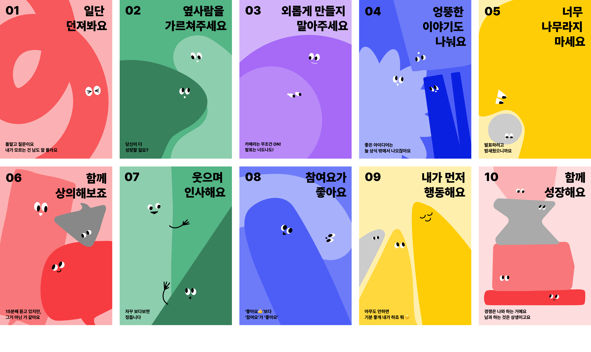

# 🌟 AIFFEL 부트캠프 학습 기록

## 📚 소개

이 저장소는 AIFFEL 부트캠프에서 6개월 동안 학습한 내용을 기록하고 공유하기 위한 공간입니다. MainQuest, Exploration, GoingDeeper 등 다양한 과정에서 배운 내용과 프로젝트 결과물을 정리했습니다.



## 📂 저장소 구조

```
.
├── Exploration
│   ├── EX01
│   │   ├── README.md
│   │   ├── bycle.ipynb
│   │   ├── diabetes.ipynb
│   │   └── train.csv
│   ├── EX02
│   │   ├── EX02.ipynb
│   │   ├── README.md
│   │   └── 보스턴 집값예측 데이터
│   │       ├── sample_submission.csv
│   │       ├── test.csv
│   │       └── train.csv
│   ├── EX03
│   │   ├── README.md
│   │   └── my_camera_app.ipynb
│   ├── EX04
│   │   ├── README.md
│   │   └── segmentation.ipynb
│   ├── EX05
│   │   ├── README.md
│   │   ├── ex05_sentiment_class.ipynb
│   │   └── images
│   │       ├── 1.png
│   │       ├── 2.png
│   │       ├── 3.png
│   │       ├── 4.png
│   │       ├── 5.png
│   │       ├── 6.png
│   │       ├── 7.png
│   │       ├── 8.png
│   │       └── 9.png
│   ├── EX06
│   │   ├── README.md
│   │   ├── evidence1.png
│   │   ├── evidence2.png
│   │   ├── evidence3.png
│   │   ├── evidence4.png
│   │   └── ex06_newsummary.ipynb
│   └── EX07
│       ├── README.md
│       └── ex07_KoreanChatbot.ipynb
├── GoingDeeper
│   ├── GD_01
│   │   ├── DeepDive_NLP_RS13.ipynb
│   │   └── README.md
│   ├── GD_02
│   │   ├── README.md
│   │   ├── image1.jpg
│   │   ├── image2.jpg
│   │   ├── image3.jpg
│   │   ├── image4.jpg
│   │   ├── topic_classifier.ipynb
│   │   └── 전체모델 정리표.png
│   ├── GD_03
│   │   ├── README.md
│   │   └── weat_practice.ipynb
│   ├── GD_04
│   │   ├── README.md
│   │   ├── k2e_trans_seq2seq.ipynb
│   │   └── review-images
│   │       ├── loss.png
│   │       ├── 회고_.png
│   │       ├── 결과.png
│   │       ├── 전처리.png
│   │       ├── 문제해결.png
│   │       └── 전처리함수코드화.png
│   ├── GD_05
│   │   ├── README.md
│   │   └── translata_colab.ipynb
│   ├── GD_06
│   │   ├── README.md
│   │   ├── mini_bert.ipynb
│   │   ├── review1_1.png
│   │   ├── review1_2.png
│   │   ├── review1_3.png
│   │   ├── review2.png
│   │   ├── review4.png
│   │   └── review5.png
│   ├── GD_07
│   │   ├── README.md
│   │   └── hf_NSMC.ipynb
│   ├── GD_08
│   │   ├── README.md
│   │   ├── myKoGPT.ipynb
│   │   └── review-images
│   │       ├── result01.png
│   │       ├── result02.png
│   │       ├── result03.png
│   │       ├── 회고.png
│   │       ├── 주석.png
│   │       └── 생성함수.png
│   ├── GD_09_10
│   │   └── README.md
│   ├── GD_11_12
│   │   └── README.md
│   ├── GD_13_14
│   │   └── README.md
│   ├── GD_15_16
│   │   └── README.md
│   ├── GD_17_18
│   │   └── README.md
│   └── myscript.bat
├── MainQuest
│   ├── Quest1
│   │   ├── README.md
│   │   └── mainQ1_GPT1.ipynb
│   ├── Quest2
│   │   └── READMe.md
│   ├── Quest3
│   │   ├── NeurIPS_Template_CheonghaeKim.pdf
│   │   └── README.md
│   ├── Quest4
│   │   └── README.md
│   ├── Quest5
│   │   └── README.md
│   ├── Quest6
│   │   └── README.md
│   ├── Quest7
│   │   └── README.md
│   └── Quest8
│       └── README.md
├── README.md
├── image
│   ├── AIFFEL_10.png
│   └── account_circle.png
└── output.png
```

## 📋 학습 내용

### MainQuest

메인 과제에서 다룬 주요 프로젝트와 학습 내용을 기록합니다.

| 주차    | 주제               | 링크                     |
| ------- | ------------------ | ------------------------ |
| Quest 1 | GPT-1 모델 구현    | [링크](MainQuest/Quest1) |
| Quest 2 | 프로젝트           | [링크](MainQuest/Quest2) |
| Quest 3 | 논문 작성 프로젝트 | [링크](MainQuest/Quest3) |
| Quest 4 | 프로젝트           | [링크](MainQuest/Quest4) |
| Quest 5 | 프로젝트           | [링크](MainQuest/Quest5) |
| Quest 6 | 프로젝트           | [링크](MainQuest/Quest6) |
| Quest 7 | 프로젝트           | [링크](MainQuest/Quest7) |
| Quest 8 | 프로젝트           | [링크](MainQuest/Quest8) |

### Exploration

탐험 과제에서 수행한 다양한 실험과 프로젝트를 기록합니다.

| 번호 | 주제                          | 링크                     |
| ---- | ----------------------------- | ------------------------ |
| E-01 | 자전거 수요예측 & 당뇨병 예측 | [링크](Exploration/EX01) |
| E-02 | 보스턴 집값 예측              | [링크](Exploration/EX02) |
| E-03 | 카메라 스티커앱 만들기        | [링크](Exploration/EX03) |
| E-04 | 사람 이미지 segmentation      | [링크](Exploration/EX04) |
| E-05 | 영화리뷰 감성분석             | [링크](Exploration/EX05) |
| E-06 | 뉴스 요약봇 만들기            | [링크](Exploration/EX06) |
| E-07 | 한국어 챗봇 만들기            | [링크](Exploration/EX07) |

### GoingDeeper

심화 학습 과정에서 다룬 고급 주제와 프로젝트를 기록합니다.

| 번호     | 주제                       | 링크                         |
| -------- | -------------------------- | ---------------------------- |
| GD-01    | 텍스트 생성 모델           | [링크](GoingDeeper/GD_01)    |
| GD-02    | 텍스트 분류 모델           | [링크](GoingDeeper/GD_02)    |
| GD-03    | Word Embedding 편향성 분석 | [링크](GoingDeeper/GD_03)    |
| GD-04    | 한-영 번역기 (Seq2Seq)     | [링크](GoingDeeper/GD_04)    |
| GD-05    | 번역기 성능 개선           | [링크](GoingDeeper/GD_05)    |
| GD-06    | BERT 모델 구현             | [링크](GoingDeeper/GD_06)    |
| GD-07    | HuggingFace 활용 모델링    | [링크](GoingDeeper/GD_07)    |
| GD-08    | KoGPT 모델 활용            | [링크](GoingDeeper/GD_08)    |
| GD-09/10 | 프로젝트                   | [링크](GoingDeeper/GD_09_10) |
| GD-11/12 | 프로젝트                   | [링크](GoingDeeper/GD_11_12) |
| GD-13/14 | 프로젝트                   | [링크](GoingDeeper/GD_13_14) |
| GD-15/16 | 프로젝트                   | [링크](GoingDeeper/GD_15_16) |
| GD-17/18 | 프로젝트                   | [링크](GoingDeeper/GD_17_18) |
